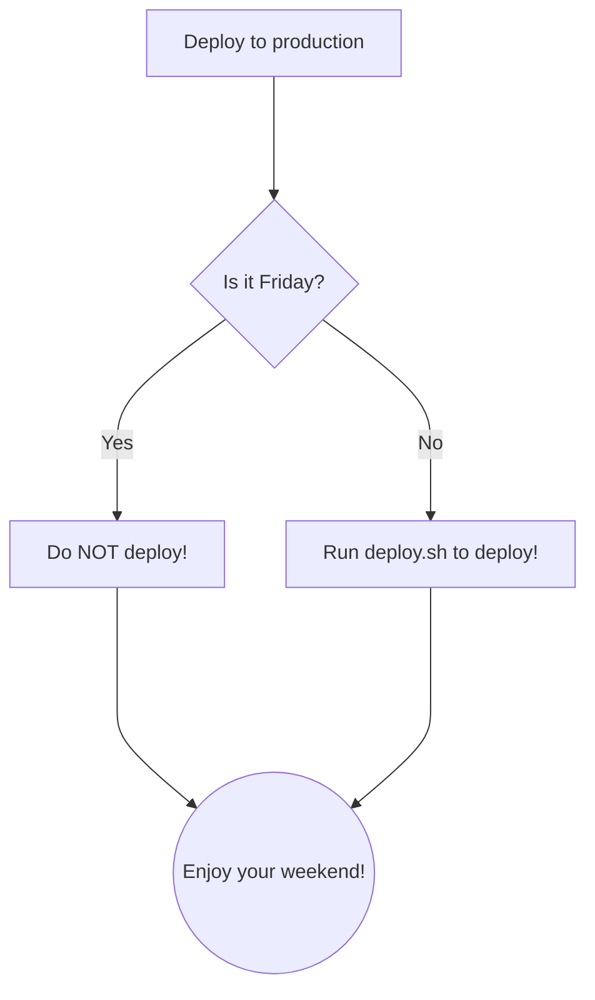
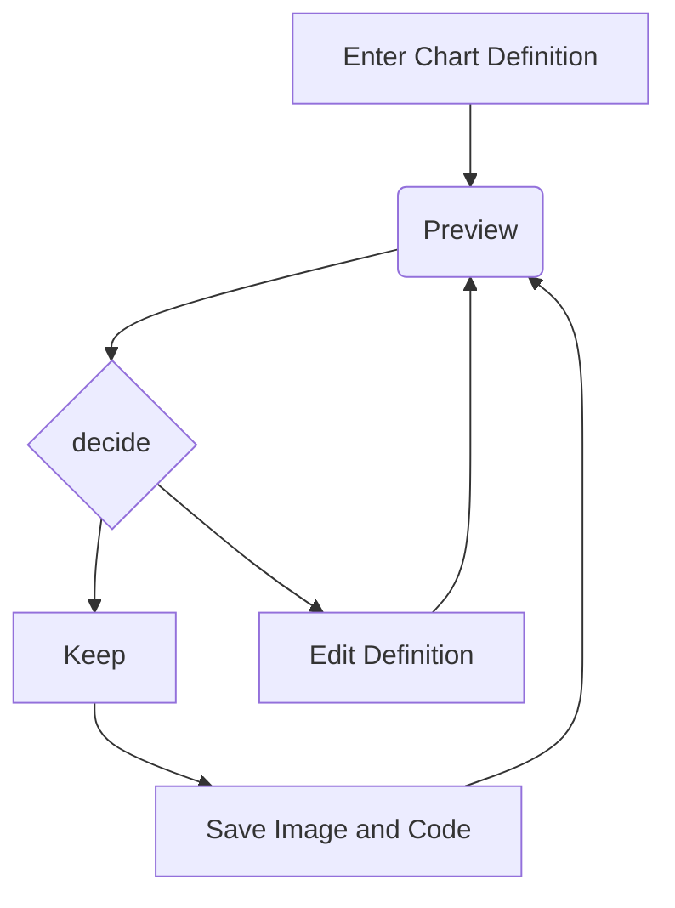
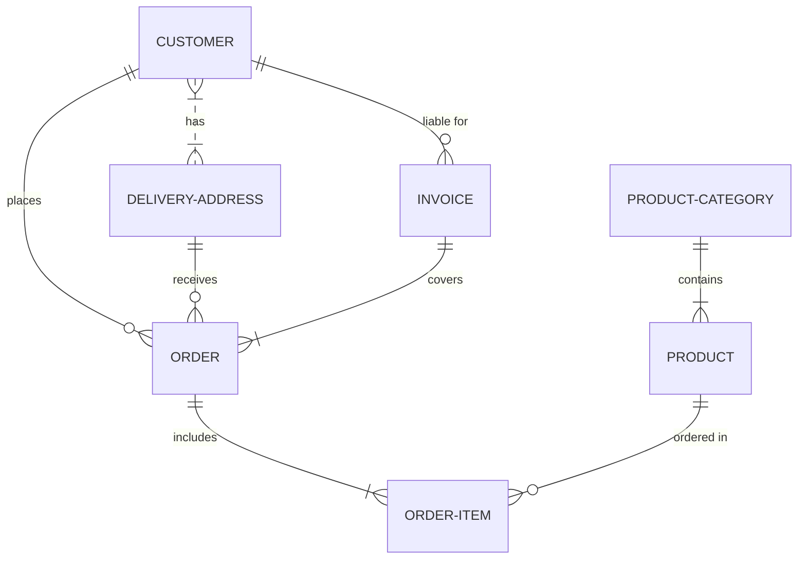
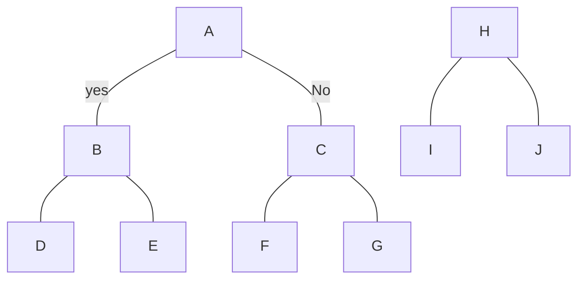
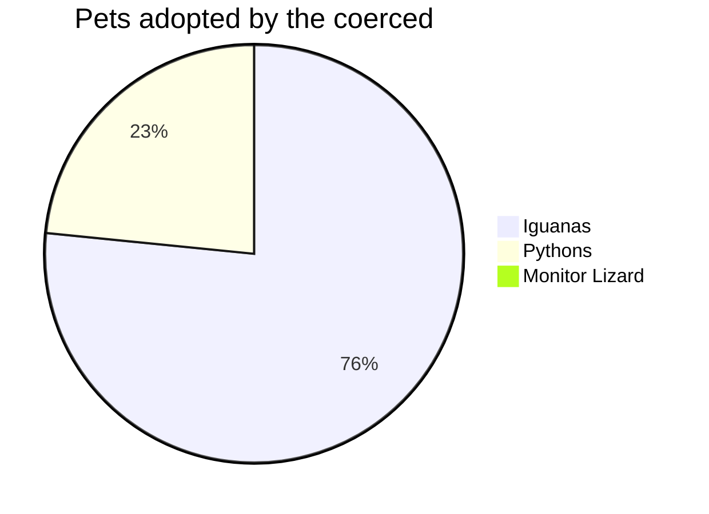

# Playing with MD again

 Did not work. Probably something about hotlinking.     

[Wikipedia](https://en.wikipedia.org)

**bold**

_italic_

`monospace`

~~struckthrough~~

Two blank spaces create a new line.  
Which is a nice trick sometimes.

Two returns create a new paragraph but we knew that already.

### Blockquotes

>Markdown is a lightweight markup language for creating formatted text using a plain-text editor. John Gruber created Markdown in 2004 as a markup language that is easier to read in its source code form. Markdown is widely used for blogging and instant messaging, and also used elsewhere in online forums, collaborative software, documentation pages, and readme files.

Maybe that is enough of the syntax for what I normally do.

---

I think that what I want to do is start writing out the blog posts in Markdown and then converting them to HTML for posting on the website. I am hoping that this will speed up production and that it will be easier to use with people outside the web browser. I may be barking mad but I want to live in a feed reader, a text-based email client, and a text editor. I'll use a browser if I need to but I don't really want to... well at least for this little experiment. [^1]

I am not exactly sure why, besides the desire to use simple stuff in my tech. I am tired of always having another new thing to learn. I am tired of added features in some bloatware app that I use. I am tired of ugly GUIs and essentially meaningless buttons. I am tired of technological bullshit.

My feed reader is essentially a newspaper. My _text_ email is essentially like old-time snail mail. My editor is a lot like my typewriter.

Yeah, I am probably being dorky. Probably nothing. I know I am being dorky and weird. I do not understand why we have to make everything complex when 99% of everything we send back and forth in the online world is JUST PLAIN OLD SIMPLE TEXT! Why does that need to be complicated?

But I author web content. That does require some markup to prettify things so that my sexy little webpage will attract readers. Right? So that is why I am using [Markdown](https://en.wikipedia.org/wiki/Markdown). Markdown is a simple markup for "prettyfying" text and making it easy to convert over to the real web mark up of HTML. HTML is the thing that actually makes the pages you see in a web browser.

So now I will add another paragraph up in the text somewhere for the express purpose of adding another footnote. [^2]

[^2]: The note was added right after the paragraph where I put the superscript mark and it appears at the end of the document as I intended.

**I JUST DISCOVERED THE VS CODE HAS A SIMPLE WEB BROWSER BUILT-IN!** That means that I do not need to keep opening a browser to check on the items that I am working on!

| This | Should | Render | A Table |
| :--- | :--- | ---: | :---: |
| and  | guess | what | I |
|reckon | that | it | does |

### Task list
Now for giggles let me see if I can figure out how to do the task list thing.

- [ ] Task #1
- [x] Task #2
- [ ] Task #3

[^3]

[^3]: Remember to add a space in the between the brackets.

Ok that was easy enough.

[^1]: Which now includes footnotes, I hope.

I have added the Github-Flavoured Markdown extension pack and it is supposed to include a diagramming too called Mermaid in it. Here is a test of that:

### Mermaid

[^4]

[^4]: Thr trick here is to call Mermaid with the 3 backticks and close with the three backticks.

I have a lot to learn with [Mermaid](https://mermaidjs.org).

Let me try the bowling pin arrangement:

### Emojis
Type : and then the common name then another :

:blush: :moyai: :coffee: :see_no_evil:

Or if you have the decimal unicode of the emoji put that in_
&#128512;

The hexidecimal works too-
&#x1F601;
&#x1F47D;
### Entity Codes

Cool. I just learned that I can add entity codes into my markdown file and they show up in the viewer.

&qint; &Im;

&COPY; 2023 by James Morgan. Some rights reserved.

### Unicode
&#9658;
&#767;
&#2400;
&#9812;

### Shavian Unicode Glyphs
Figured it out. It needs an x in hexidecimal!

&#x10450; Peep  
&#x10451; Tot  
&#x10452; Kick  
&#x10453; Fee  
&#x10454; Thigh  
&#x10455; So  
&#x10456; Sure  
&#x10457; Church  
&#x10458; Yea  
&#x1045A; Bib   
&#x1045B; Dead   
&#x1045C; Gag   
&#x1045D; Vow   
&#x1045E; They   
&#x1045F; Zoo  
&#x10460; Measure  
&#x10461; Judge  
&#x10462; Woe  
&#x1047F; Yew  

Etc etc. There are about 50 of these. I am not typing them all out right now. I am not that bored.

It would seriously suck to type out a whole document in Unicode codes.

AHA! Shavian will work in the decimal!
&#66684;

~~Shavian unicode doesn't work with the viewer.~~

## Bottom line 

I can do just about everything that I really ever do with naught but a text editor, feed reader, and email client. I'll keep a browser for grins and giggles.

